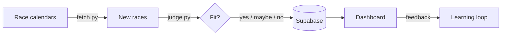

# Run Radar

A race-finding pipeline with a conversational agent on top.
Deterministic automation. Agentic interaction. About running.

```
┌─────────────────────────────────────────────────────────────┐
│                                                             │
│   PIPELINE (runs at 6am, no input needed)                   │
│   ─────────────────────────────────────────                 │
│   fetch races → judge with AI → save to database            │
│                                                             │
├─────────────────────────────────────────────────────────────┤
│                                                             │
│   AGENT (runs when you ask)                                 │
│   ─────────────────────────────                             │
│   /radar → check for new races                              │
│   "show me trail races" → conversation                      │
│                                                             │
└─────────────────────────────────────────────────────────────┘
```

## How it flows



## The pattern

**Pipeline** = tested, scheduled, runs without you
**Agent** = flexible, conversational, runs when you want

Same data. Two interfaces. Best of both.

## Quick start

```bash
python main.py          # run the pipeline
python attend.py review # see recommendations
```

Or ask Claude `/radar`.

## Structure

```
run-radar/
├── main.py              ← pipeline: fetch → judge → save
├── CLAUDE.md            ← agent instructions
├── .claude/skills/      ← /radar command
└── config/prefs.md      ← race preferences (the judge's brain)
```

## Stack

`python` · `claude haiku` · `supabase` · `github actions`

---

*Finding races so I can focus on running them.*
