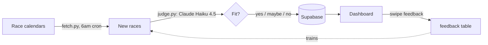

# Run Radar

Turns "should I sign up for this race?" into an automated daily decision — not a spreadsheet I forget to check.

## The problem

Race calendars are noisy and scattered. Deciding if a race fits (distance, terrain, timing, cost) used to cost me 10+ minutes of tab-switching every time one popped up. Run Radar makes that call every morning before I'm awake, and gets better every time I correct it.

## How it flows



## The interesting part

The judge is a Claude Haiku 4.5 call, not a hardcoded rule list — but it isn't trusted blind. `eval.py` grades every prompt change against a hand-labeled set of races before it ships, so a "small tweak" can't silently make it worse. A stub mode (`USE_STUB`) covers everything else without burning API calls.

## Runs unattended

GitHub Actions triggers `main.py` daily at 6am — fetch, judge, save. No manual step. See `.github/workflows/daily.yml`.

## Quick start

```bash
# Run manually
python main.py

# Check new races with judgments
python attend.py review

# Mark a race as attending
python attend.py add <race_id>
```

Or just open `dashboard.html` in a browser.

## Stack

`python` · `claude-haiku-4.5` · `supabase` · `github-actions`

## How it's organized

```
run-radar/
├── main.py              ← Daily radar (fetch → judge → save)
├── attend.py            ← Mark races, review recommendations
├── judge.py             ← LLM judgment (Claude Haiku 4.5)
├── eval.py              ← Grades judge changes against labeled races
├── dashboard.html        ← Visual interface
│
├── config/
│   ├── prefs.md          ← My preferences (edit to tune the judge)
│   └── eval_labels.md    ← Hand-labeled races used to grade the judge
│
├── docs/
│   ├── ARCHITECTURE.md
│   ├── DATA_FLOW.txt
│   ├── SECURITY.txt      ← Keys and permissions
│   └── DESIGN.txt        ← Dashboard design principles
│
└── digest.md             ← Text log of surfaced races
```

## Data lives in Supabase

| Table | Purpose |
|-------|---------|
| `races` | All discovered races |
| `judgments` | AI recommendations (yes/maybe/no) |
| `bucket_list` | Flagship races I care about |
| `feedback` | My responses (trains the judge) |

## Fixing the judge

If the judge gets it wrong, edit `config/prefs.md` in plain English. Then run `python eval.py` to check accuracy didn't drop.

---

Part of a series on turning raw signals into scored, routed action — same spine, different systems: signal-radar (finding the signal) and crm-signal-router-pattern (routing it safely). *(links go live once those repos are public.)*
