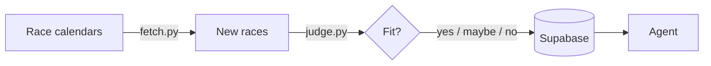

# Run Radar

A race-finding pipeline with a conversational agent on top.
Deterministic automation. Agentic interaction. About running.

```
┌─────────────────────────────────────────────────────────────┐
│                                                             │
│   PIPELINE (runs at 6am, no input needed)                   │
│   ─────────────────────────────────────────                 │
│   fetch races → judge with AI → save to database            │
│                                                             │
├─────────────────────────────────────────────────────────────┤
│                                                             │
│   AGENT (runs when you ask)                                 │
│   ─────────────────────────────                             │
│   /radar → check for new races                              │
│   "show me trail races" → conversation                      │
│                                                             │
└─────────────────────────────────────────────────────────────┘
```

## How it flows



## The pattern

**Pipeline** = tested, scheduled, runs without you
**Agent** = flexible, conversational, runs when you want

Same data. Two interfaces. Best of both.

## Structure

```
run-radar/
│
├── main.py                      ← orchestrator: fetch → judge → save
├── fetch.py                     ← pulls races from RunSignUp API
├── judge.py                     ← Claude Haiku scores each race
├── db.py                        ← Supabase read/write
├── eval.py                      ← grades judge accuracy (76%+ required)
│
├── CLAUDE.md                    ← agent instructions
├── .claude/
│   ├── skills/                  ← agent skills (/radar, /recap)
│   └── memory.md                ← key decisions
│
├── config/
│   ├── prefs.md                 ← race preferences (judge's brain)
│   └── eval_labels.md           ← hand-labeled test set
│
└── .github/workflows/daily.yml  ← 6am cron trigger
```

## Stack

`python` · `claude haiku` · `supabase` · `github actions`

---

*Finding races so I can focus on running them.*
